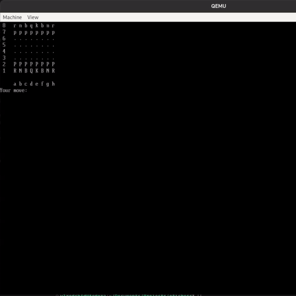

# EFI CHESS



## References 

- [UEFI 2.6](https://uefi.org/sites/default/files/resources/UEFI%20Spec%202_6.pdf)
- [Queso Fuego (UEFI DEV)](https://youtu.be/t3iwBQg_Gik?list=PLT7NbkyNWaqZYHNLtOZ1MNxOt8myP5K0p)
- [Bare Minimum Chess in C](https://youtu.be/927rfAPHX6E)

## Building

### Prerequisite

CMake, llvm-toolchain, [edk2-ovmf](https://github.com/tianocore/tianocore.github.io/wiki/How-to-build-OVMF), qemu, [zig-cross](https://github.com/mrexodia/zig-cross)

### Commands

blindly follow these, and dig down the rabbit hole using google to know what these commands does

```
git clone --recursive https://github.com/w1redch4d/efichess && cd efichess
cmake -G Ninja -B build -DCMAKE_TOOLCHAIN_FILE=./zig-cross/cmake/zig-toolchain-uefi64.cmake -DCMAKE_EXPORT_COMPILE_COMMANDS=ON
cmake --build build
```

Then run the file in an emulator:

```
cd build
mkdir -p esp/EFI/BOOT
cp chess.efi esp/EFI/BOOT/BOOTx64.EFI
cp /path/to/OVMF.fd .
qemu-system-x86_64 -drive if=pflash,format=raw,file=OVMF.fd -M accel=kvm:tcg -net none -serial stdio -drive format=raw,file=fat:rw:esp
```
